# Database Schema & ERD — Sistem KEP

> ERD ini merupakan turunan dari **Product Backlog** (Epic 0 — PBF01) dan flowchart bisnis proses sistem KEP.
> Diagram ditulis dalam sintaks **Mermaid erDiagram** sehingga bisa divisualisasi langsung di VS Code (ekstensi Markdown Preview Mermaid Support), GitHub, atau editor Mermaid Live (<https://mermaid.live>).

---

## 1. Ringkasan Entitas

| Kelompok | Tabel |
|----------|-------|
| Auth & Users | `users`, `password_reset_tokens` |
| Authorization (Spatie) | `roles`, `permissions`, `model_has_roles`, `model_has_permissions`, `role_has_permissions` |
| Pengajuan EC | `proposals`, `proposal_documents` |
| Review | `reviewer_assignments`, `reviewer_feedbacks` |
| Keputusan & Surat | `decisions`, `certificates` |
| Amendment | `amendments`, `amendment_documents` |
| Termination | `terminations`, `termination_documents` |
| Template & Konfigurasi | `templates`, `system_configs`, `email_templates` |
| Notifikasi & Audit | `notifications`, `audit_logs` |

Total: **21 tabel** (16 domain + 5 tabel Spatie Permission).

---

## 2. ERD (Mermaid)

```mermaid
erDiagram
    %% ============ AUTH & USERS (Spatie Permission polymorphic) ============
    users ||--o{ model_has_roles : "has roles (morph)"
    roles ||--o{ model_has_roles : "granted to"
    users ||--o{ model_has_permissions : "direct perms (morph)"
    permissions ||--o{ model_has_permissions : "granted to"
    roles ||--o{ role_has_permissions : "has"
    permissions ||--o{ role_has_permissions : "belongs to"

    %% ============ PROPOSAL ============
    users ||--o{ proposals : "submits (applicant)"
    proposals ||--o{ proposal_documents : "contains"
    users ||--o{ proposal_documents : "uploads"

    %% ============ REVIEW ============
    proposals ||--o{ reviewer_assignments : "routed to"
    amendments ||--o{ reviewer_assignments : "routed to (major)"
    users ||--o{ reviewer_assignments : "reviews"
    reviewer_assignments ||--o| reviewer_feedbacks : "generates"

    %% ============ DECISION ============
    proposals ||--o{ decisions : "receives"
    amendments ||--o{ decisions : "receives"
    users ||--o{ decisions : "decides / approves"

    %% ============ CERTIFICATE ============
    proposals ||--o| certificates : "issues"
    users ||--o{ certificates : "signs (ketua)"

    %% ============ AMENDMENT ============
    proposals ||--o{ amendments : "has"
    users ||--o{ amendments : "submits"
    amendments ||--o{ amendment_documents : "contains"

    %% ============ TERMINATION ============
    proposals ||--o{ terminations : "has"
    users ||--o{ terminations : "submits"
    terminations ||--o{ termination_documents : "contains"

    %% ============ TEMPLATES & CONFIG ============
    users ||--o{ templates : "uploads (admin)"

    %% ============ NOTIFICATIONS & AUDIT ============
    users ||--o{ notifications : "receives"
    users ||--o{ audit_logs : "performs"

    users {
        bigint id PK
        string name
        string email UK
        string password
        string phone
        text address
        string expertise "nullable, reviewer"
        string status "pending,active,inactive"
        string active_role_name "nullable, session switcher"
        timestamp email_verified_at
        string remember_token
        timestamp created_at
        timestamp updated_at
        timestamp deleted_at "nullable, soft delete"
    }

    roles {
        bigint id PK
        string name
        string guard_name "web"
        timestamp created_at
        timestamp updated_at
    }

    permissions {
        bigint id PK
        string name
        string guard_name "web"
        timestamp created_at
        timestamp updated_at
    }

    model_has_roles {
        bigint role_id FK
        string model_type
        bigint model_id
    }

    model_has_permissions {
        bigint permission_id FK
        string model_type
        bigint model_id
    }

    role_has_permissions {
        bigint permission_id FK
        bigint role_id FK
    }

    password_reset_tokens {
        string email PK
        string token
        timestamp created_at
    }

    proposals {
        bigint id PK
        string protocol_number UK
        bigint applicant_id FK
        string title
        text description
        string review_type "nullable,exempted,expedited,full_board"
        string status "new_proposal,on_review,revised,awr,resubmission,approved,disapproved,certificate_issued,amendment_submitted,terminated"
        timestamp submitted_at
        timestamp decided_at "nullable"
        timestamp created_at
        timestamp updated_at
        timestamp deleted_at "nullable, soft delete"
    }

    proposal_documents {
        bigint id PK
        bigint proposal_id FK
        string document_type "surat_pengantar,proposal,participant_form,icf,advertisement,brochure,data_tool,research_team,cv,budget,other"
        string file_name
        string file_path
        bigint file_size
        int version
        bigint uploaded_by FK
        timestamp uploaded_at
    }

    reviewer_assignments {
        bigint id PK
        bigint proposal_id FK "nullable"
        bigint amendment_id FK "nullable"
        bigint reviewer_id FK
        bigint assigned_by FK
        date due_date
        string status "pending,completed,overdue"
        timestamp assigned_at
        timestamp completed_at "nullable"
    }

    reviewer_feedbacks {
        bigint id PK
        bigint assignment_id FK "unique, 1-to-1"
        text notes
        string recommendation "approved,awr,resubmission"
        string attachment_path "nullable"
        timestamp submitted_at
    }

    decisions {
        bigint id PK
        bigint proposal_id FK "nullable"
        bigint amendment_id FK "nullable"
        bigint decided_by FK "sekretariat"
        bigint chairman_id FK "nullable, ketua (full board)"
        string decision "approved,awr,resubmission,disapproved"
        text notes
        text applicant_feedback "nullable"
        text rejection_reason "nullable"
        timestamp decided_at
    }

    certificates {
        bigint id PK
        bigint proposal_id FK "unique, 1-to-1"
        string certificate_number UK
        string file_path
        bigint signed_by FK "nullable until signed"
        timestamp signed_at "nullable"
        string status "pending_signature,issued,revoked"
        timestamp issued_at "nullable"
        timestamp created_at
    }

    amendments {
        bigint id PK
        bigint proposal_id FK
        bigint applicant_id FK
        text description
        text reason
        string classification "nullable,minor,major"
        string status "submitted,on_review,approved,revision_required,rejected"
        timestamp submitted_at
        timestamp decided_at "nullable"
    }

    amendment_documents {
        bigint id PK
        bigint amendment_id FK
        string file_name
        string file_path
        int version
        timestamp uploaded_at
    }

    terminations {
        bigint id PK
        bigint proposal_id FK
        bigint applicant_id FK
        date effective_date
        string category
        text description
        text participant_status
        text safeguard_steps
        string classification "nullable,safety_related,non_safety"
        string status "submitted,on_review,investigation_required,approved,finalized"
        timestamp submitted_at
        timestamp finalized_at "nullable"
    }

    termination_documents {
        bigint id PK
        bigint termination_id FK
        string file_name
        string file_path
        timestamp uploaded_at
    }

    templates {
        bigint id PK
        string name
        string version
        text description
        string file_path
        date effective_date
        boolean is_active
        bigint uploaded_by FK
        timestamp created_at
        timestamp updated_at
    }

    system_configs {
        bigint id PK
        string key UK
        text value
        string type "string,int,bool,json"
        text description
        timestamp updated_at
    }

    email_templates {
        bigint id PK
        string event_type UK
        string subject
        text body
        timestamp updated_at
    }

    notifications {
        bigint id PK
        bigint user_id FK
        string title
        text message
        string type
        string link "nullable"
        timestamp read_at "nullable"
        timestamp created_at
    }

    audit_logs {
        bigint id PK
        bigint user_id FK "nullable"
        string action
        string subject_type "nullable"
        bigint subject_id "nullable"
        json details
        string ip_address
        timestamp created_at
    }
```



---

## 3. Catatan Desain

### 3.1 Multi-role dengan Spatie Laravel Permission

- Menggunakan **Spatie Laravel Permission v7**. Relasi User ↔ Role bersifat **polymorphic** via `model_has_roles` (bukan pivot biasa). Seorang user bisa punya >1 role (misal Applicant + Reviewer).
- Tambahan 5 tabel dari package: `roles`, `permissions`, `model_has_roles`, `model_has_permissions`, `role_has_permissions`.
- Kolom `users.active_role_name` (custom, bukan bawaan Spatie) menyimpan role aktif per user untuk **role switcher** PB05. Diisi ke salah satu role yang dimiliki user. Default saat login = role pertama.
- Permission-level granularity bisa ditambahkan nanti bila diperlukan (misal `proposal.approve`, `certificate.sign`). Untuk MVP cukup role-level.

### 3.2 Reviewer Assignment polymorphic-lite

- Satu `reviewer_assignment` bisa untuk **Proposal** (review awal) atau **Amendment** (major amendment — lihat Epic 8).
- Dimodelkan dengan **dua FK nullable** (`proposal_id`, `amendment_id`) daripada morph, agar lebih eksplisit dan mudah di-query. **Constraint**: tepat satu dari keduanya harus terisi (enforce di validation/observer).
- Alternatif: morphTo polymorphic. Pertimbangkan bila nanti ada tipe review lain (misal continuing review).

### 3.3 Decision polymorphic-lite

- Sama seperti reviewer_assignment: `decisions` bisa untuk Proposal atau Amendment. Dua FK nullable.

### 3.4 Status lifecycle Proposal

Status utama (sesuai flowchart):

```
new_proposal → on_review → (awr | resubmission | approved | disapproved)
approved → certificate_issued → (amendment_submitted | terminated)
awr | resubmission → revised → on_review (loop)
```

**Keputusan**: riwayat transisi status disimpan di tabel **`audit_logs`** (subject_type=Proposal). Timeline PB20 di-render dengan query `audit_logs` filter `subject_type=Proposal AND subject_id=X AND action LIKE 'status.%'`. Tidak perlu tabel `proposal_status_histories` terpisah.

### 3.5 Versioning dokumen

- `proposal_documents.version` increment otomatis saat Applicant upload revisi (lihat PBF05). Versi lama TIDAK dihapus (sesuai PB58).
- Pola path: `proposals/{protocol_number}/{document_type}/v{version}/{filename}`.

### 3.6 Certificate lifecycle

- `certificates.status`: `pending_signature` → `issued` (setelah ketua tanda tangan, PB34) → `revoked` (jika termination, PB44).
- `signed_by` nullable sampai ditandatangani.

### 3.7 Audit log & Notification

- `audit_logs.subject_type` + `subject_id` = morphable (polymorphic) untuk menunjuk entitas apapun (Proposal, User, Amendment, dll).
- `notifications` dibuat sederhana (custom), BUKAN menggunakan Laravel Notifications default karena kebutuhan query/filter yang lebih fleksibel. Pertimbangkan pakai `notifiable_type`/`notifiable_id` polymorphic jika nanti non-user juga dikirimi.

### 3.8 Index yang disarankan

- `proposals`: index pada `applicant_id`, `status`, `protocol_number`.
- `reviewer_assignments`: composite index `(reviewer_id, status)`, `(proposal_id, status)`.
- `proposal_documents`: composite index `(proposal_id, document_type, version)`.
- `notifications`: composite index `(user_id, read_at)` untuk query unread count.
- `audit_logs`: index pada `(subject_type, subject_id)` dan `user_id`.

---

## 4. Mapping ke Product Backlog

| Tabel | User Story Terkait |
|-------|-------------------|
| users, roles, role_user | PB01–PB11 (Epic 1, Epic 2) |
| password_reset_tokens | PB06 |
| proposals, proposal_documents | PB17–PB21 (Epic 4), PB22–PB25 (Epic 5) |
| reviewer_assignments, reviewer_feedbacks | PB25–PB29 (Epic 5, Epic 6) |
| decisions | PB30–PB32, PB35 (Epic 7) |
| certificates | PB33, PB34, PB36 (Epic 7) |
| amendments, amendment_documents | PB37–PB40 (Epic 8) |
| terminations, termination_documents | PB41–PB44 (Epic 9) |
| templates | PB17, PB45–PB47 (Epic 4, Epic 10) |
| system_configs | PB48–PB50 (Epic 11) |
| email_templates, notifications | PB51–PB53 (Epic 12) |
| audit_logs | PB57 (Epic 14), lintas epic (logging) |

---

## 5. Keputusan Desain (Confirmed)

| # | Topik | Keputusan |
|---|-------|-----------|
| 1 | Storage driver | **Local disk** saja. Gunakan disk `documents` (driver `local`) di `config/filesystems.php`. Tidak perlu S3/MinIO untuk MVP. |
| 2 | Active role (role switcher PB05) | Simpan di **kolom** `users.active_role_name` (bukan session). Alasan: sinkron antar device, bisa di-query. |
| 3 | Status history Proposal | Gunakan tabel **`audit_logs`** generik. Tidak membuat tabel `proposal_status_histories` tersendiri. |
| 4 | Role/Permission management | Pakai **Spatie Laravel Permission v7**. Lihat section 6 untuk instalasi. |
| 5 | Soft delete | Aktif untuk `users` dan `proposals` (`deleted_at` via trait `SoftDeletes`). Tabel lain tidak perlu (cascade/audit). |

---

## 6. Instalasi Spatie Laravel Permission v7

Verifikasi: URL docs resmi <https://spatie.be/docs/laravel-permission/v7/installation-laravel> **benar dan valid**.

### 6.1 Langkah instalasi (untuk Laravel 11+)

```bash
# 1. Install package
composer require spatie/laravel-permission

# 2. Publish config + migration (PermissionServiceProvider)
php artisan vendor:publish --provider="Spatie\Permission\PermissionServiceProvider"

# 3. Clear config cache
php artisan optimize:clear

# 4. Jalankan migration (akan membuat 5 tabel Spatie)
php artisan migrate
```

### 6.2 Registrasi middleware alias di `bootstrap/app.php`

Laravel 11+ tidak lagi menggunakan `app/Http/Kernel.php`. Daftarkan alias di `bootstrap/app.php`:

```php
use Spatie\Permission\Middleware\RoleMiddleware;
use Spatie\Permission\Middleware\PermissionMiddleware;
use Spatie\Permission\Middleware\RoleOrPermissionMiddleware;

->withMiddleware(function (Middleware $middleware) {
    $middleware->alias([
        'role'               => RoleMiddleware::class,
        'permission'         => PermissionMiddleware::class,
        'role_or_permission' => RoleOrPermissionMiddleware::class,
    ]);
})
```

### 6.3 Tambahkan trait `HasRoles` ke `app/Models/User.php`

```php
use Spatie\Permission\Traits\HasRoles;

class User extends Authenticatable
{
    use HasRoles, SoftDeletes, Notifiable;
    // ...
}
```

### 6.4 Pakai di route (contoh untuk PBF04)

```php
Route::middleware(['auth', 'role:sekretariat'])->group(function () {
    Route::get('/sekretariat/inbox', [InboxController::class, 'index']);
});

// Multi-role access
Route::middleware(['auth', 'role:sekretariat|ketua_komisi_etik'])->group(function () {
    Route::post('/proposals/{proposal}/decide', [DecisionController::class, 'store']);
});
```

### 6.5 Seeder roles awal (untuk PBF02)

```php
// database/seeders/RoleSeeder.php
use Spatie\Permission\Models\Role;

foreach (['applicant', 'reviewer', 'sekretariat', 'ketua_komisi_etik', 'admin'] as $roleName) {
    Role::firstOrCreate(['name' => $roleName, 'guard_name' => 'web']);
}
```

### 6.6 Catatan penting

- **MySQL 8+**: jika muncul error `1071 Specified key was too long`, ikuti panduan di Prerequisites Spatie (set `Schema::defaultStringLength(191)` di `AppServiceProvider`).
- **Cache**: Spatie menyimpan cache roles/permissions. Setelah seeder atau perubahan, jalankan `php artisan permission:cache-reset`.
- Jangan rename/ubah tabel Spatie — kecuali mengikuti guide khusus di docs.
