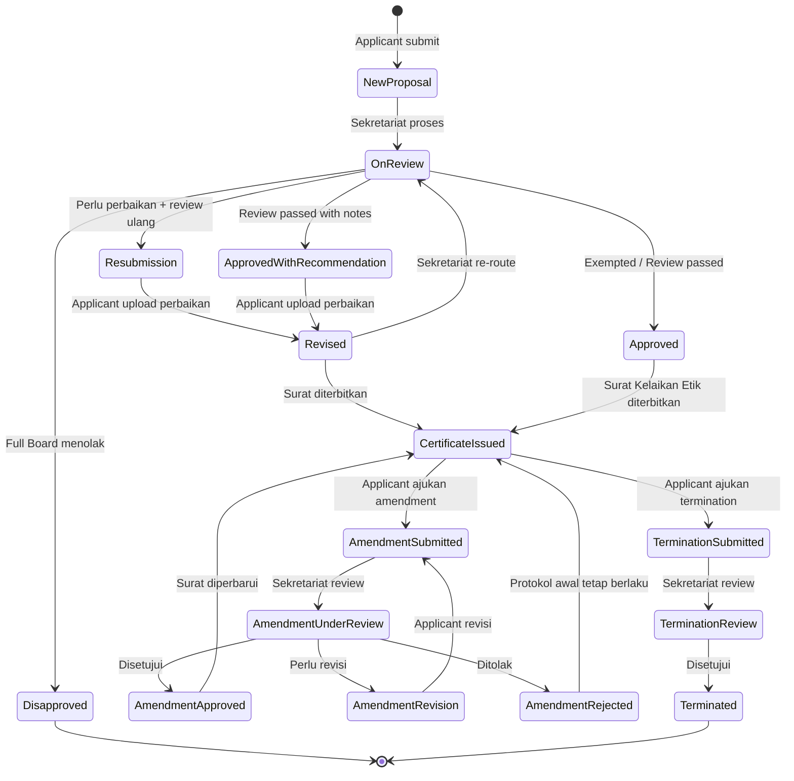

# Flowchart Sistem KEP — Index & Ringkasan Perubahan

> Dokumen ini merupakan **index** dari seluruh flowchart Sistem KEP yang telah di-update dan ditambahkan fitur baru dalam format **Mermaid**.

---

## Daftar File Flowchart

| # | File | Status | Deskripsi |
|---|------|--------|-----------|
| 1 | [Flowchart_Updated_Level1.md](./Flowchart_Updated_Level1.md) | 🔄 Updated | Alur utama sistem (high-level) dengan semua role & fitur baru |
| 2 | [Flowchart_Updated_Registrasi_Level2.md](./Flowchart_Updated_Registrasi_Level2.md) | 🔄 Updated | Registrasi akun: Applicant, Reviewer, + pembuatan akun internal oleh Admin |
| 3 | [Flowchart_Updated_Pengajuan_Level2.md](./Flowchart_Updated_Pengajuan_Level2.md) | 🔄 Updated | Pengajuan EC baru + monitoring status |
| 4 | [Flowchart_Updated_Review_Level2.md](./Flowchart_Updated_Review_Level2.md) | 🔄 Updated | Proses review: Exempted, Expedited, Full Board + Ketua Komisi Etik |
| 5 | [Flowchart_New_Amendment.md](./Flowchart_New_Amendment.md) | 🆕 New | Pengajuan perubahan protokol (amendment) |
| 6 | [Flowchart_New_Termination.md](./Flowchart_New_Termination.md) | 🆕 New | Penghentian dini protokol (termination) |
| 7 | [Flowchart_New_Admin_Management.md](./Flowchart_New_Admin_Management.md) | 🆕 New | Workflow Admin: user, template, konfigurasi, laporan |

---

## Ringkasan Perubahan dari Versi Sebelumnya

### Role Baru yang Ditambahkan

| Role | Tanggung Jawab Utama |
|------|---------------------|
| **👑 Ketua Komisi Etik** | Memimpin rapat Full Board Review, persetujuan akhir, menandatangani Surat Kelaikan Etik, menerima eskalasi safety-related termination |
| **🔧 Admin** | Manajemen pengguna (CRUD, role assignment), manajemen template, konfigurasi sistem, laporan & statistik, audit log |

### Fitur Baru yang Ditambahkan

| Fitur | Deskripsi |
|-------|-----------|
| **Amendment** | Pengajuan perubahan protokol yang sudah approved (minor/major) |
| **Termination** | Penghentian dini protokol dengan kategorisasi safety/non-safety |
| **Admin Management** | Dashboard admin untuk pengelolaan sistem |
| **Akun Internal** | Pembuatan akun oleh Admin untuk Sekretariat, Reviewer, Ketua |

### Perubahan pada Alur Existing

| Alur | Perubahan |
|------|-----------|
| **Level 1** | Ditambah jalur Amendment & Termination dari Dashboard Applicant |
| **Registrasi** | Ditambah alur pembuatan akun internal oleh Admin |
| **Review** | Ketua Komisi Etik ditambahkan di Full Board Review (memimpin rapat panel & tanda tangan akhir) |
| **Post-Decision** | Surat Kelaikan Etik harus ditandatangani Ketua Komisi Etik |

---

## Matriks Role vs Fitur

| Fitur | Admin | Sekretariat | Reviewer | Ketua Komisi Etik | Applicant |
|-------|:-----:|:-----------:|:--------:|:-----------------:|:---------:|
| Login | ✅ | ✅ | ✅ | ✅ | ✅ |
| Dashboard | Admin | Sekretariat | Reviewer | Ketua | Applicant |
| **Registrasi** |
| Buat akun internal | ✅ | - | - | - | - |
| Aktivasi akun applicant/reviewer | - | ✅ | - | - | - |
| Self-register | - | - | - | - | ✅ |
| Manage roles | ✅ | - | - | - | - |
| **Pengajuan EC** |
| Download template | - | - | - | - | ✅ |
| Submit ajuan baru | - | - | - | - | ✅ |
| Monitor status | - | ✅ | - | ✅ | ✅ |
| **Review EC** |
| Evaluasi dokumen | - | ✅ | - | - | - |
| Tentukan jenis review | - | ✅ | - | - | - |
| Assign reviewer | - | ✅ | - | - | - |
| Review & feedback | - | - | ✅ | - | - |
| Keputusan Expedited | - | ✅ | - | - | - |
| Keputusan Full Board | - | ✅ | - | ✅ | - |
| Pimpin rapat panel | - | - | - | ✅ | - |
| Tanda tangan Surat | - | - | - | ✅ | - |
| **Amendment** |
| Submit amendment | - | - | - | - | ✅ |
| Review amendment | - | ✅ | ✅ | ✅* | - |
| Approve minor | - | ✅ | - | - | - |
| **Termination** |
| Submit termination | - | - | - | - | ✅ |
| Process termination | - | ✅ | - | - | - |
| Handle safety issues | - | - | - | ✅ | - |
| **Admin** |
| Manajemen template | ✅ | - | - | - | - |
| Konfigurasi sistem | ✅ | - | - | - | - |
| Laporan & statistik | ✅ | - | - | ✅ | - |
| Audit log | ✅ | - | - | - | - |

*Ketua terlibat di review amendment hanya jika Full Board*

---

## Status Lifecycle Lengkap

