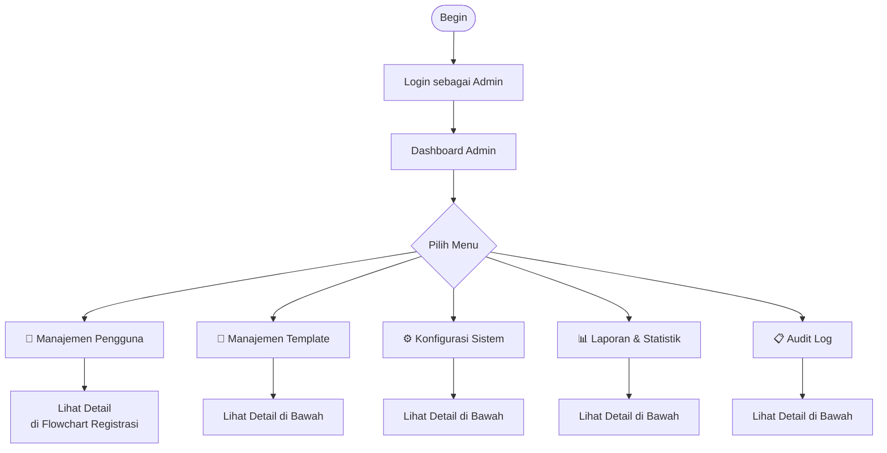
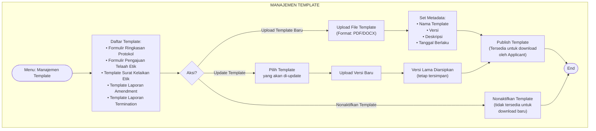
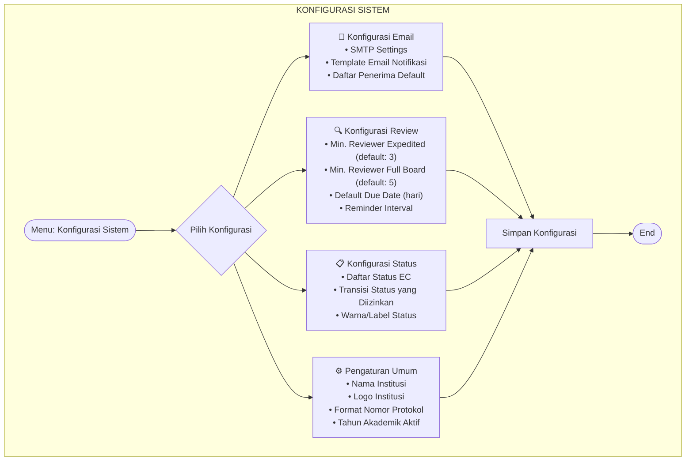
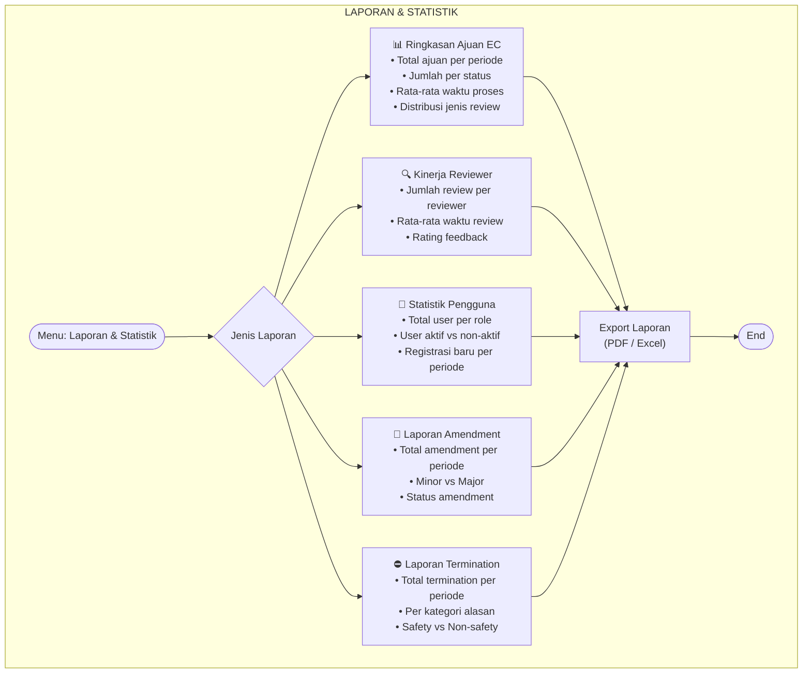
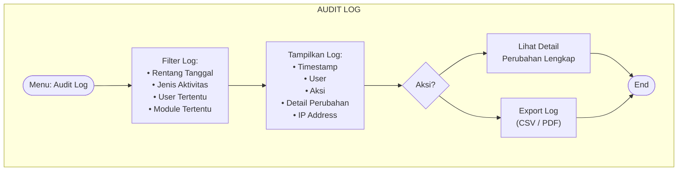

# Flowchart Admin Management — NEW

> **Fitur baru** — Workflow khusus untuk role **Admin** yang mengelola sistem.
> Admin bukan bagian dari alur review EC, melainkan mengelola infrastruktur & pengguna sistem.

---

## A. Dashboard Admin — Overview

---

## B. Manajemen Template Dokumen

---

## C. Konfigurasi Sistem

---

## D. Laporan & Statistik

---

## E. Audit Log

---

## Ringkasan Fitur Admin

| Modul | Deskripsi | Akses |
|-------|-----------|-------|
| **Manajemen Pengguna** | CRUD user, assign/remove role, aktivasi/nonaktifkan akun | Admin only |
| **Manajemen Template** | Upload, update, arsipkan template dokumen | Admin only |
| **Konfigurasi Sistem** | Email, review settings, status, pengaturan umum | Admin only |
| **Laporan & Statistik** | Dashboard analytics, export laporan | Admin, Ketua Komisi Etik |
| **Audit Log** | Tracking semua aktivitas sistem | Admin only |
