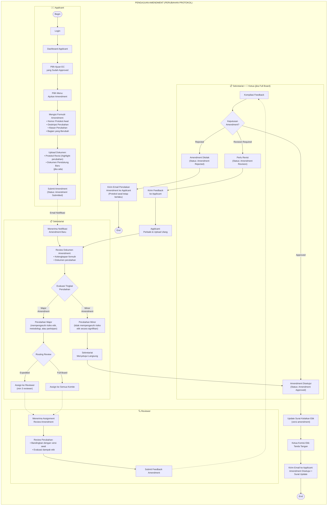
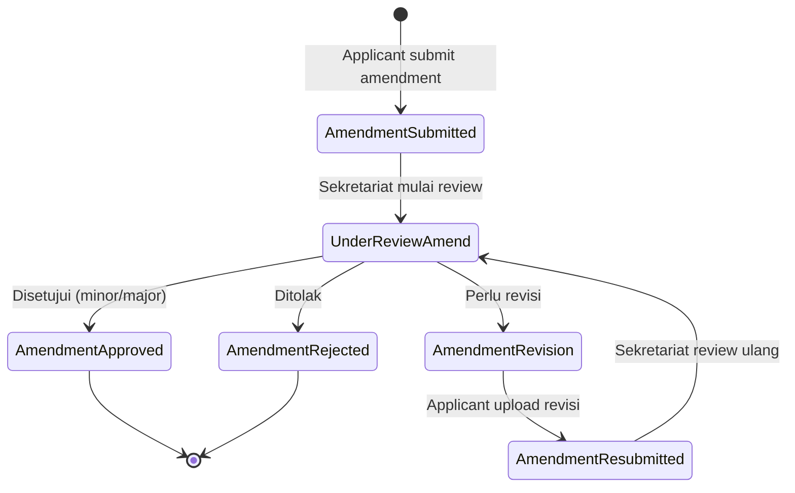

# Flowchart Amendment (Pengajuan Perubahan Protokol) — NEW

> **Fitur baru** yang belum ada di flowchart sebelumnya.
> Berdasarkan ruang lingkup di KEP REQUIREMENT: "*Pengajuan protokol dengan perubahan (amendment)*"
> 
> Amendment diajukan ketika peneliti ingin melakukan perubahan pada protokol penelitian yang **sudah disetujui** (sudah mendapat Surat Kelaikan Etik).

---

## Alur Amendment

---

## Status Lifecycle Amendment

## Catatan Penting Amendment

| Aspek | Keterangan |
|-------|-----------|
| **Siapa yang bisa ajukan?** | Hanya Applicant yang protokolnya sudah berstatus **Approved** |
| **Minor Amendment** | Perubahan kecil yang tidak mempengaruhi risiko etik secara signifikan. Contoh: perubahan jadwal, penambahan lokasi minor |
| **Major Amendment** | Perubahan besar pada metodologi, partisipan, atau hal yang mempengaruhi risiko etik. Perlu review ulang |
| **Protokol awal** | Jika amendment ditolak, protokol awal (yang sudah approved) **tetap berlaku** |
| **Surat Kelaikan Etik** | Jika amendment disetujui, Surat Kelaikan Etik di-update/addendum |
