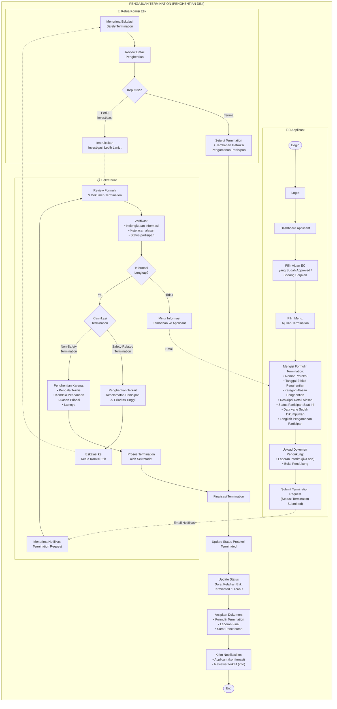
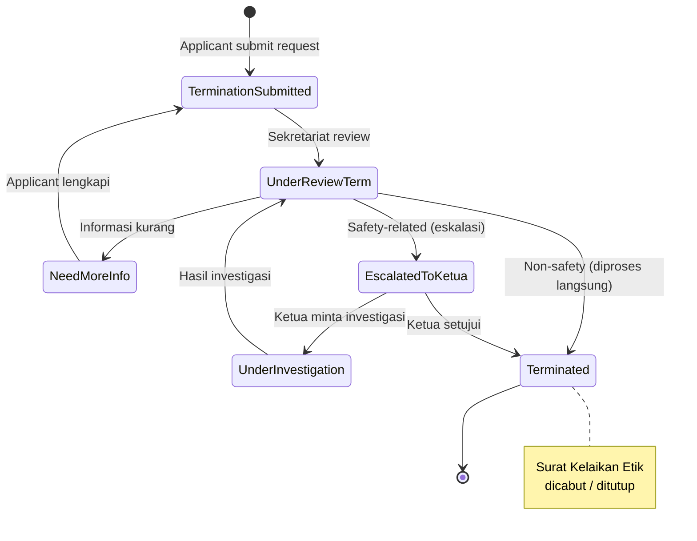

# Flowchart Termination (Penghentian Dini Protokol) — NEW

> **Fitur baru** yang belum ada di flowchart sebelumnya.
> Berdasarkan ruang lingkup di KEP REQUIREMENT: "*Protokol dengan penghentian dini (Termination)*"
> 
> Termination dilakukan ketika peneliti menghentikan penelitian **sebelum selesai** setelah protokol sudah disetujui. Bisa karena alasan keamanan partisipan, temuan tak terduga, kendala teknis/pendanaan, atau alasan lainnya.

---

## Alur Termination

---

## Status Lifecycle Termination

---

## Kategori Alasan Termination

| Kategori | Contoh | Prioritas | Alur |
|----------|--------|-----------|------|
| **Safety-Related** | Efek samping tak terduga pada partisipan, risiko keselamatan baru ditemukan | 🔴 Tinggi | Eskalasi ke Ketua Komisi Etik |
| **Kendala Teknis** | Metodologi tidak dapat dilanjutkan, alat/perangkat tidak tersedia | 🟡 Normal | Diproses Sekretariat |
| **Kendala Pendanaan** | Dana penelitian habis/ditarik | 🟡 Normal | Diproses Sekretariat |
| **Alasan Pribadi** | Peneliti utama berhalangan, pindah institusi | 🟡 Normal | Diproses Sekretariat |
| **Temuan Penelitian** | Tujuan penelitian sudah tercapai lebih awal | 🟡 Normal | Diproses Sekretariat |
| **Permintaan Sponsor** | Sponsor menarik dukungan | 🟡 Normal | Diproses Sekretariat |

## Dampak Termination

| Aspek | Dampak |
|-------|--------|
| **Status Protokol** | Berubah menjadi **Terminated** |
| **Surat Kelaikan Etik** | Ditutup / Dicabut (tanggal efektif tercatat) |
| **Data Penelitian** | Harus diamankan sesuai prosedur etik |
| **Partisipan** | Harus diinformasikan dan mendapat perlindungan |
| **Arsip** | Seluruh dokumen tetap tersimpan di sistem |
