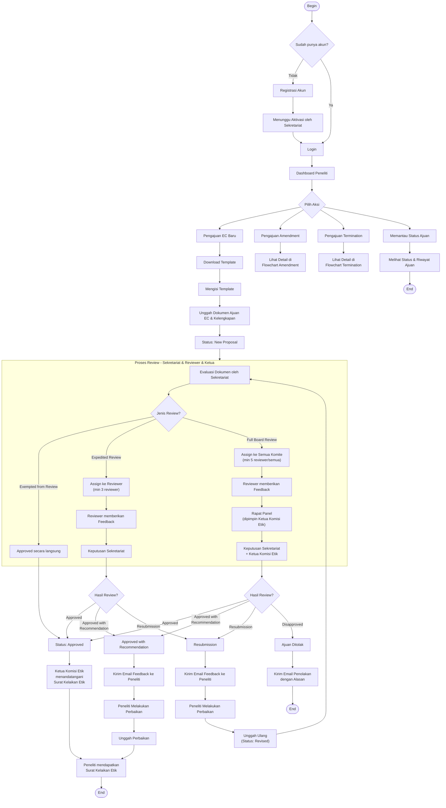

# Flowchart Level 1 — Alur Utama Sistem KEP (Updated)

> **Perubahan dari versi sebelumnya:**
> - Menambahkan role **Admin** (manajemen sistem & pengguna)
> - Menambahkan role **Ketua Komisi Etik** (persetujuan akhir & tanda tangan Surat Kelaikan Etik pada Full Board Review)
> - Menambahkan jalur **Amendment** (pengajuan perubahan protokol setelah approval)
> - Menambahkan jalur **Termination** (penghentian dini protokol)

## Catatan Perubahan Role

### Ketua Komisi Etik
- Memimpin **Rapat Panel** pada Full Board Review
- Memberikan persetujuan akhir bersama Sekretariat pada Full Board Review
- Menandatangani **Surat Kelaikan Etik** (untuk semua jalur review)
- Memiliki akses untuk monitoring seluruh ajuan

### Admin
- Tidak terlibat langsung dalam alur review EC
- Workflow terpisah: manajemen user, template, dan konfigurasi sistem
- Detail di flowchart terpisah (Admin Management)
