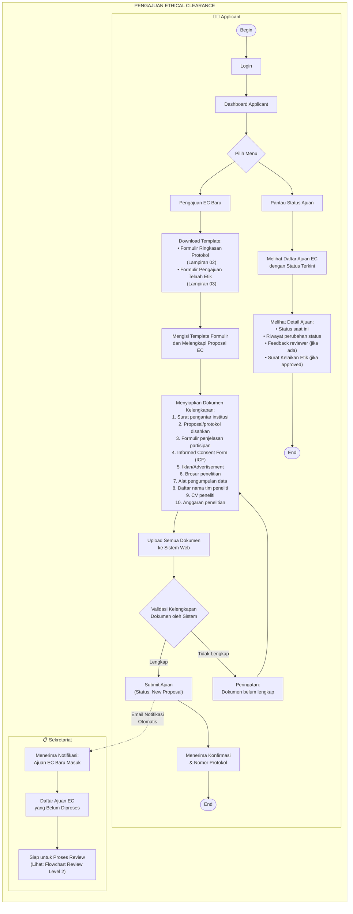

# Flowchart Pengajuan EC — Level 2 (Updated)

> **Perubahan dari versi sebelumnya:**
> - Menambahkan detail status tracking
> - Menambahkan validasi kelengkapan dokumen
> - Memperjelas notifikasi ke Sekretariat
> - Tidak ada perubahan signifikan untuk role baru (Admin & Ketua tidak terlibat di tahap pengajuan)

## Daftar Status Ajuan EC

| Status | Deskripsi |
|--------|-----------|
| **New Proposal** | Baru diunggah, belum diproses Sekretariat |
| **On Review** | Sedang diproses/ditelaah oleh Reviewer |
| **Approved** | Disetujui, Surat Kelaikan Etik diterbitkan |
| **Approved with Recommendation** | Disetujui dengan catatan perbaikan (tanpa review ulang) |
| **Resubmission** | Perlu perbaikan dan review ulang |
| **Revised** | Dokumen perbaikan telah diunggah ulang |
| **Disapproved** | Ditolak, tidak laik etik |
