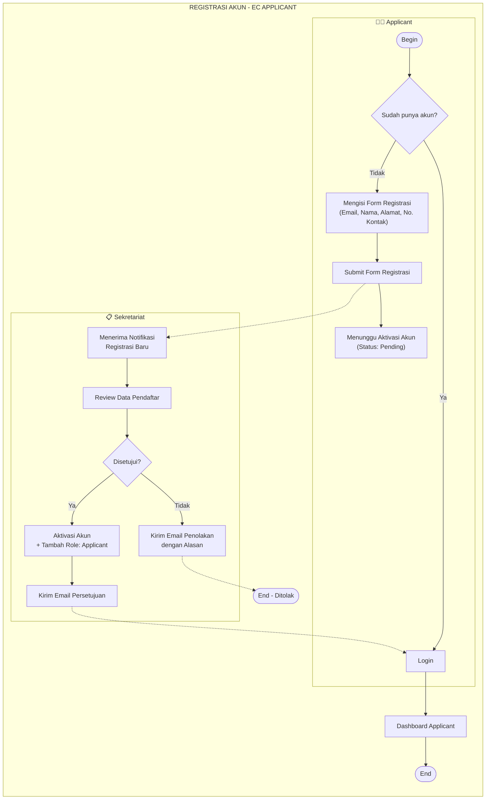
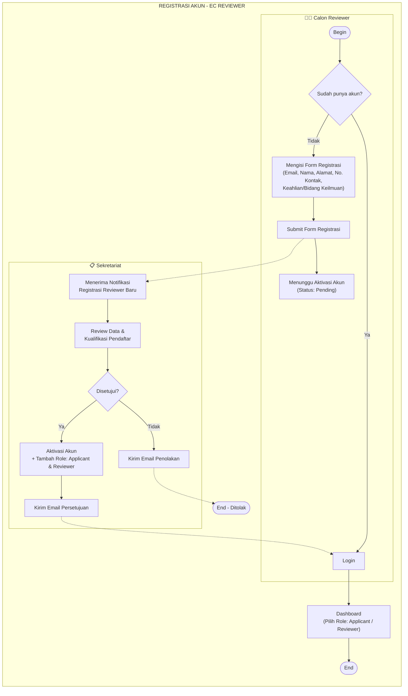
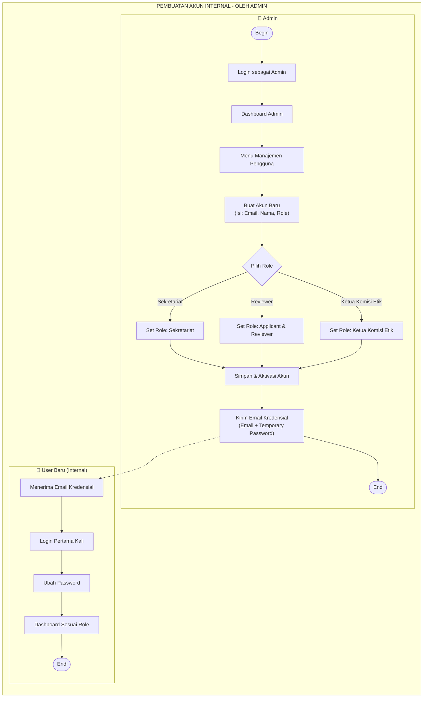
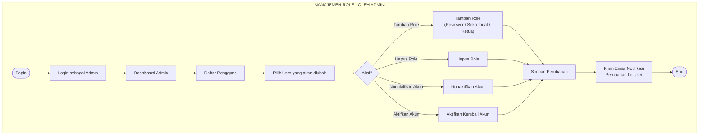

# Flowchart Registrasi Akun — Level 2 (Updated)

> **Perubahan dari versi sebelumnya:**
> - Menambahkan alur registrasi yang dipicu **Admin** (pembuatan akun internal: Sekretariat, Reviewer, Ketua Komisi Etik)
> - Membedakan 2 skenario besar: **Self-Registration (Applicant)** vs **Admin-Created Account (Internal)**
> - Mempertegas peran Admin dalam pengelolaan akun

---

## A. Registrasi Akun Applicant (Self-Registration)

Alur ini sama dengan versi sebelumnya. Applicant mendaftar sendiri, lalu Sekretariat mengaktivasi.

---

## B. Registrasi Akun Reviewer (Self-Registration + Approval)

Reviewer mendaftar sendiri, Sekretariat memverifikasi dan memberikan role Applicant **& Reviewer**.

---

## C. Pembuatan Akun Internal oleh Admin (Sekretariat, Reviewer, Ketua Komisi Etik)

Akun untuk role internal **tidak self-register**, melainkan dibuat oleh **Admin**.

---

## D. Manajemen Role oleh Admin (Update Role Existing User)

## Ringkasan Role & Hak Akses pada Registrasi

| Role | Cara Registrasi | Siapa yang Mengaktivasi | Role yang Diberikan |
|------|----------------|------------------------|---------------------|
| **Applicant** | Self-register via web | Sekretariat | Applicant |
| **Reviewer** | Self-register via web | Sekretariat | Applicant & Reviewer |
| **Sekretariat** | Dibuat oleh Admin | Admin (aktif langsung) | Sekretariat |
| **Ketua Komisi Etik** | Dibuat oleh Admin | Admin (aktif langsung) | Ketua Komisi Etik |
| **Admin** | Pre-configured / Seed | Sistem | Admin (Super User) |
