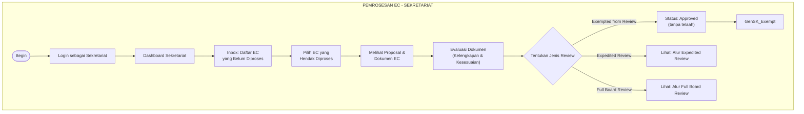
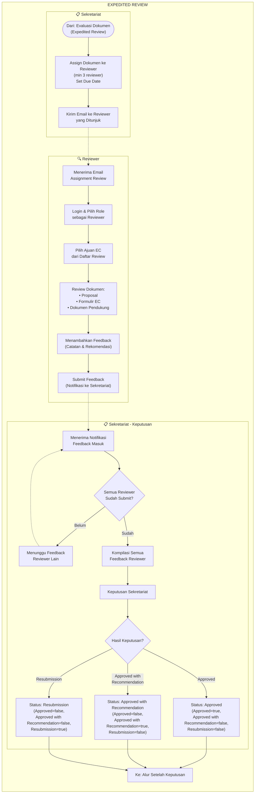
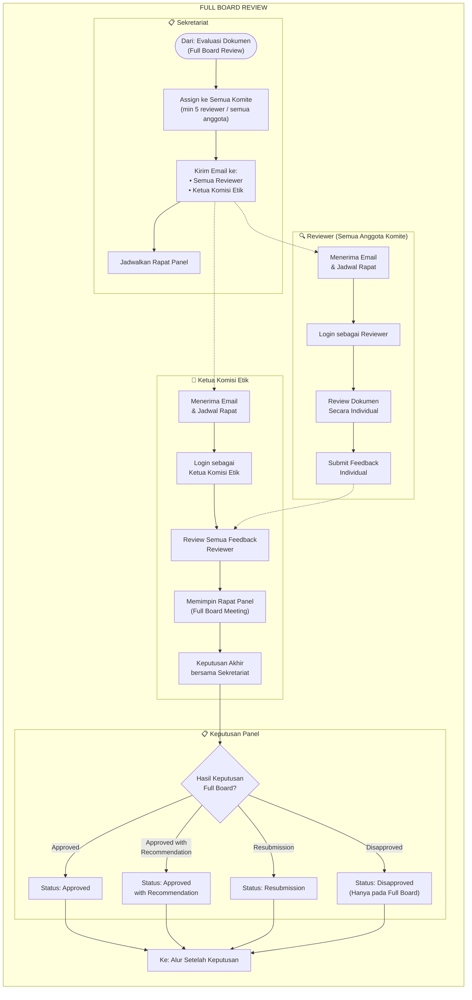
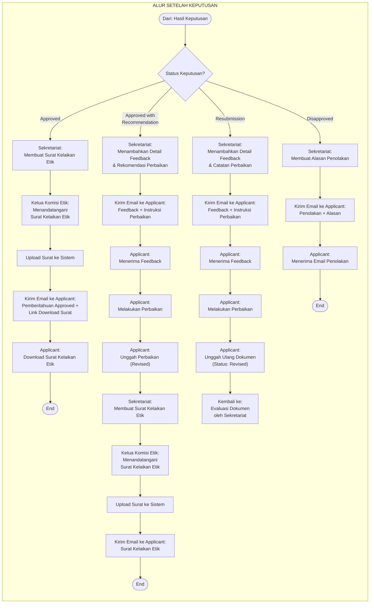

# Flowchart Review/Pemrosesan EC — Level 2 (Updated)

> **Perubahan dari versi sebelumnya:**
> - Menambahkan **Ketua Komisi Etik** pada alur Full Board Review (memimpin rapat panel & persetujuan akhir)
> - Menambahkan proses **penandatanganan Surat Kelaikan Etik** oleh Ketua Komisi Etik
> - Memperjelas alur Disapproved dengan pembuatan alasan dan notifikasi

---

## A. Alur Pemrosesan oleh Sekretariat (Evaluasi & Routing)

---

## B. Alur Expedited Review (min 3 Reviewer)

---

## C. Alur Full Board Review (min 5 Reviewer / Semua Komite + Ketua)

---

## D. Alur Setelah Keputusan (Post-Decision Flow)

## Ringkasan Keterlibatan Role dalam Review

| Tahap | Sekretariat | Reviewer | Ketua Komisi Etik | Applicant |
|-------|:-----------:|:--------:|:-----------------:|:---------:|
| Evaluasi Dokumen | ✅ | - | - | - |
| Penentuan Jenis Review | ✅ | - | - | - |
| Assign Reviewer | ✅ | - | - | - |
| Review & Feedback | - | ✅ | - | - |
| Rapat Panel (Full Board) | ✅ | ✅ | ✅ Memimpin | - |
| Keputusan Expedited | ✅ | - | - | - |
| Keputusan Full Board | ✅ | - | ✅ Persetujuan | - |
| Buat Surat Kelaikan Etik | ✅ | - | ✅ Tanda tangan | - |
| Terima Surat/Feedback | - | - | - | ✅ |
| Perbaikan & Resubmit | - | - | - | ✅ |
